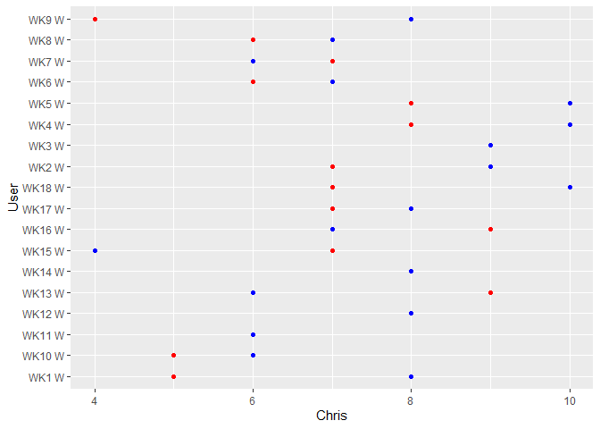

Pickem Charts
================

``` r
library(tidyverse)
library(moderndive)
library(janitor)
```

``` r
Pickem <- read_csv(here::here("2021- Pickem League Wins.csv"))
```

``` r
  ggplot(data=Pickem, aes(x=Chris, y=User)) + geom_point(alpha=.5)
```

<!-- -->
